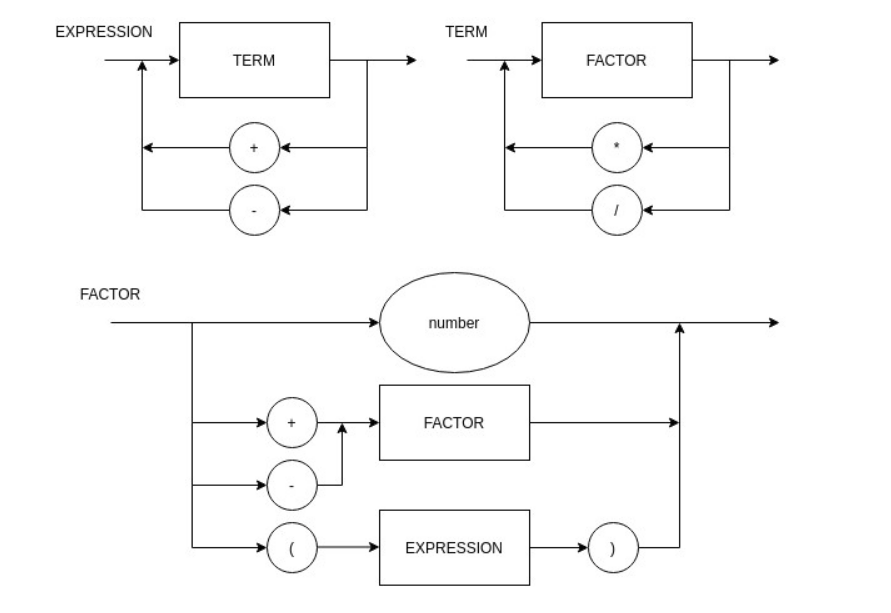

# compilador

Diagrama Sintático

EBNF

> digit = "0" | "1" | "2" | "3"  | "4" | "5" | "6" | "7" | "8" | "9" ;

>EXPRESSION = TERM, { ("+" | "-"), TERM } ;

>TERM = FACTOR, { ("*" | "/"), FACTOR } ;

>FACTOR = ("+" | "-") FACTOR | "(" EXPRESSION ")" | digit ;
